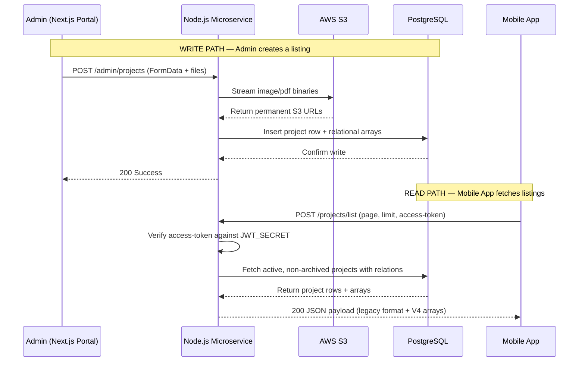
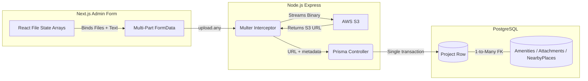

# Product Requirements Document (PRD)
**Project:** Kolte Patil Project Portal — Admin CMS & Mobile API
**Version:** V4 (Phase 6 — Final Release)
**Date:** April 2026
**Status:** Review Ready

---

## 🧩 1. Overview

### Problem Statement
Kolte Patil's internal team had no scalable way to create, manage, and publish real estate project listings to their Mobile App. Project data was being managed manually, with no CMS, no media hosting pipeline, and no structured API contract. Adding a new field required coordinating changes across 3 teams.

### Context
The mobile app already exists and is live. It consumes a fixed legacy JSON format from a backend endpoint. Any changes to that format would break the consumer app. The solution must introduce new data complexity (amenities, nearby places, media galleries) while preserving all existing JSON field names so the mobile app does not break. The mobile team will however need to update the app to display the new fields — but existing listing and detail screens will continue to work without changes.

### Objective
Build a unified backend + admin web portal that:
- Gives the Kolte Patil team a clean CMS to create and manage project listings
- Streams uploaded media directly to AWS S3 and returns permanent URLs
- Serves the legacy mobile app format perfectly, now extended with new relational data arrays

---

## 🎯 2. Goals & Non-Goals

### Goals
- Enable admins to publish a complete project listing with 16 structured fields in a single form submission
- Host all media (images, icons, brochures) on AWS S3 with permanent public URLs
- Serve the Mobile App via a backward-compatible `POST /projects/list` endpoint
- Track how many times each project is opened in the app via a click counter
- Allow admins to toggle visibility (`isActive`) and soft-delete (`isArchived`) without data loss

### Non-Goals
- A consumer-facing web portal or landing page
- Push notifications or in-app messaging
- Payment or lead capture functionality
- Changes to the Mobile App's existing codebase

---

## 👤 3. Users & Personas

### Primary User — Kolte Patil Admin
- **Who**: Internal marketing/content team managing real estate listings
- **Pain Points**: No structured tool to publish listings; S3 URLs had to be manually pasted; no way to add amenities or distances without a developer
- **Needs**: A clean form UI that handles file uploads, auto-generates S3 links, and pushes directly to the database

### Secondary User — Mobile App Consumer (End User)
- **Who**: Prospective homebuyers browsing listings on the Kolte Patil app
- **Pain Points**: Stale project data; no amenity info; no visual gallery in listings
- **Needs**: Rich project cards with thumbnails, amenities, nearby places, and brochure access — without app updates

---

## 🔄 4. User Stories / Jobs-to-be-Done

| # | As a... | I want to... | So that... |
| :--- | :--- | :--- | :--- |
| 1 | Admin | create a new project | it can be listed for users on the mobile app |
| 2 | Admin | add and manage project details | users can understand details about the project |
| 3 | Admin | upload a project brochure & images | users can view visually represented information |
| 4 | Admin | view all created projects | I can manage existing listings |
| 5 | Admin | edit an existing project | I can keep project information up to date |
| 6 | Admin | toggle active/inactive status | I can temporarily hide a project without deleting it |
| 7 | Admin | delete a project | it is soft-deleted and removed from the mobile app view |
| 8 | Admin | archive a project | it is removed from the mobile app without permanent data loss |
| 9 | App User | view a list of projects & details | I can explore and evaluate available options |
| 10 | App User | navigate paginated project listings | I can browse efficiently |

### Implementation Resolutions

**1. Admin | create a new project**
When the admin clicks "+ Publish New Listing" on the Dashboard, a form opens with 14 mandatory fields. All fields are validated client-side before submission. On publish, the backend creates the project in a single transactional Prisma write.

**2. Admin | add and manage project details**
The form collects base text details alongside 4 dynamic relational arrays: Community Amenities, Property Amenities, Nearby Places, and Image Attachments. Each array supports adding new rows dynamically.

**3. Admin | upload a project brochure & images**
All image and PDF fields use `<input type="file" />`. The backend intercepts every binary via `multer`, saves it locally (prototype) or to S3 (production), and generates a permanent URL stored in PostgreSQL.

**4. Admin | view all created projects**
The root Dashboard (`/dashboard`) queries `GET /admin/projects` and renders all non-archived projects as visual tiles.

**5. Admin | edit an existing project**
`PATCH /admin/projects/:id` handles status toggle mutations (isActive / isArchived) against the Prisma layer.

**6. Admin | toggle active/inactive status**
Toggling `isActive = false` immediately removes the project from the Mobile App's feed without deleting any data. It can be re-enabled instantly.

**7. Admin | delete a project**
`DELETE /admin/projects/:id` performs a **soft delete** — setting `isArchived: true` and `isActive: false`. Data is preserved for auditing. It cannot be recovered from the UI.

**8. Admin | archive a project**
Same mechanism as delete — the `isArchived` flag gates the project out of all consumer API queries while keeping the row in the database.

**9. App User | view a list of projects & details**
`POST /projects/list` returns a fully nested JSON payload including all relational arrays. The payload is backward-compatible with the app's existing parsing logic.

**10. App User | navigate paginated project listings**
The endpoint reads `page` and `limit` from the request body and applies SQL `offset` / `take` logic via Prisma transactions.

---

## 🧱 5. Functional Requirements

### Admin Dashboard
- When the admin loads `/dashboard`, the system displays all projects where `isArchived = false`, ordered by `createdAt DESC`
- When an admin clicks "+ Publish New Listing", the system opens a multi-section creation form
- When an admin submits the form with any empty mandatory field, the system blocks submission and highlights the missing field
- When an admin clicks "Delete", the system sets `isArchived: true` and `isActive: false` — it does NOT hard-delete the row

### Project Creation Form (16 Fields)

The admin fills in the following fields across 4 sections of the form:

| Section | Field | Type | Notes |
| :--- | :--- | :--- | :--- |
| Basic Property Details | Project Name | Text | Required |
| Basic Property Details | Location | Text | Shown on tile and detail page |
| Basic Property Details | Description | Textarea | Required |
| Basic Property Details | Google Maps Iframe URL | Text | Embedded map on detail page |
| Basic Property Details | Project Status | Dropdown | ONGOING / LATEST / COMPLETED |
| Property Configuration | Bedrooms | Number | Integer |
| Property Configuration | Bathrooms | Number | Integer |
| Property Configuration | Price | Text | e.g. "₹ 82 Lacs" |
| Property Configuration | Carpet Area | Text | e.g. "1200 Sqft" |
| Property Configuration | Floor Level | Text | e.g. "2nd Floor" |
| Property Configuration | Furnishing | Dropdown | Unfurnished / Semi-Furnished / Furnished |
| Media & Attachments | Thumbnail | File Upload | Single image — used as tile banner |
| Media & Attachments | Brochure | File Upload | PDF only |
| Media & Attachments | Image Gallery | File Upload (multi) | Multiple JPG/PNG files |
| Location & Amenities | Community Amenities | Dynamic rows | Each row: `{name, image upload}` — add as many as needed |
| Location & Amenities | Property Amenities | Dynamic rows | Each row: `{name}` (Text only) — add as many as needed |
| Location & Amenities | Nearby Places | Fixed 5 rows | Pre-seeded categories: Hospital, School, Shopping Mall, Airport, Railway Station. Admin fills in `distanceKm`. System Auto-maps Stock Icons. |

**System behavior**: When the admin submits the form, the system uploads all files to S3 (or `/uploads` in prototype), generates permanent URLs, then creates the project record and all relational rows in a single database transaction.

### Mobile API
- When `POST /projects/list` is called with a valid `access-token` header, the system returns all projects where `isActive = true` and `isArchived = false`
- When `POST /projects/list` is called without an `access-token` header, the system returns HTTP 401
- When `POST /projects/:id/click` is called, the system increments `clickCount` by 1 on that project row

---

## 🔌 6. Data & API Contracts

### A. Project Listing Endpoint

**Request**
```
POST /projects/list
Headers:
  Content-Type: application/json
  access-token: <token>

Body:
{
  "page": "1",
  "limit": "10"
}
```

**Response**
```json
{
  "status_code": 200,
  "status_message": "Success",
  "response_data": [
    {
      "projectId": 12356,
      "projectName": "Casa Venero",
      "description": "test",
      "location": "Pune",
      "locationIframe": "<iframe ... />",
      "projectStatus": "ONGOING",
      "thumbnailUrl": "https://s3.amazonaws.com/.../thumbnail.jpg",
      "overview": {
        "bedrooms": 3,
        "bathrooms": 2,
        "price": "₹ 82 Lacs",
        "furnishing": "Furnished",
        "floor": "2nd Floor",
        "area": "2000 sqft"
      },
      "project_brochure": "https://s3.amazonaws.com/.../brochure.pdf",
      "attachments": [
        { "name": "img_1", "imageUrl": "https://s3...", "extension": "PNG" }
      ],
      "communityAmenities": [
        { "name": "Pool", "imageUrl": "https://s3..." }
      ],
      "propertyAmenities": [
        { "name": "CCTV" }
      ],
      "nearbyPlaces": [
        { "category": "Mall", "distanceKm": 2.5 }
      ]
    }
  ],
  "pagination": {
    "current_page": 1,
    "per_page": 10,
    "total_items": 42,
    "total_pages": 5,
    "has_next": true,
    "has_prev": false
  }
}
```

### B. Click Analytics Endpoint

```
POST /projects/:id/click
No headers or body required.
Response: { "status_code": 200, "status_message": "Metrics tracked successfully" }
```
A simple counter — increments `clickCount` in the database by 1 every time the Mobile App opens a project detail view.

### Error Handling
| Scenario | HTTP Code | Response |
| :--- | :--- | :--- |
| Missing `access-token` | 401 | `"Unauthorized: Invalid or expired access token"` |
| Invalid `page` / `limit` | 404 | `"Bad Request: Missing required field"` |
| Server/DB error | 500 | `"Internal Server Error"` |

---

## 🧭 7. User Flows

### Admin: Publish a New Project
1. Admin logs in → lands on `/dashboard`
2. Clicks "+ Publish New Listing"
3. Fills in basic details (name, location, status, description)
4. Fills in configuration (bedrooms, floor, area, furnishing)
5. Uploads thumbnail, brochure, and gallery images
6. Adds community amenities with images, and property amenities (text only)
7. Fills in distance (Km) for each of the 5 fixed nearby place categories (stock icons are auto-mapped)
8. Clicks "Validate & Publish" → client-side validation runs → POST submitted to `POST /admin/projects`
9. On success → redirected back to `/dashboard`

### Mobile App User: Browse Listings
1. App launches → fires `POST /projects/list` with `page: 1, limit: 10`
2. Renders project tiles using `projectName`, `location`, `thumbnailUrl`
3. User taps a tile → App fires `POST /projects/:id/click` (view counter)
4. Detail page renders using `overview`, `attachments`, `communityAmenities`, `propertyAmenities`, `nearbyPlaces`

---

## 🎨 8. Design & UX References

### Admin Portal & Consumer UI
- Built with **Next.js App Router** + **TailwindCSS**
- **Desktop Layout:** Premium 2-column layout (70/30 split) for project detail pages with a **sticky conversion panel** containing key facts, price, and CTAs (Enquire Now / Refer).
- **Mobile Layout:** Fully responsive, collapsing into a single-column layout.
- 4-section form layout for creation: Basic Property Details → Property Configuration → Media & Attachments → Location & Amenities
- Dynamic array rows for community amenities with `+ Add New` buttons
- Nearby Places use fixed category rows (disabled category field) with editable distance and stock UI icons
- Validation errors surface at the top of the form with the specific missing field called out

### HLD — System Architecture
Two distinct flows: the Admin **write path** and the Mobile App **read path**.



### LLD — Data Flow (Admin Write Path)


---

## ⚠️ 9. Edge Cases & Failure Scenarios

| Scenario | Behavior |
| :--- | :--- |
| Admin submits form with a blank amenity name | Client-side validation blocks submit and surfaces error |
| Admin uploads no gallery images | Validation blocks submit: "At least one gallery image required" |
| S3 upload fails mid-transaction | Prisma transaction rolls back; no partial project is created |
| Mobile app calls `/projects/list` without token | Returns HTTP 401 immediately — no DB query executed |
| `/projects/:id/click` called with non-existent ID | Prisma throws, returns HTTP 500 |
| `distanceKm` submitted as non-numeric | `parseFloat` returns `NaN`; Prisma rejects the write at DB level |
| Admin archives a project already archived | `isArchived` is set to `true` again — no error, idempotent |

---

## 📊 10. Success Metrics

| Metric | Target |
| :--- | :--- |
| **Primary**: Time to publish a new project listing | < 5 minutes from form open to live on app |
| **Secondary**: Mobile App API response time | < 400ms for paginated list of 10 projects |
| **Secondary**: `clickCount` data accuracy | 100% — every project open fires the analytics endpoint |
| **Guardrail**: Mobile App existing behavior unchanged | Zero breaking changes to existing JSON field names |

---

## 🚀 11. Rollout Plan

| Phase | Description |
| :--- | :--- |
| **Phase 1 — Prototype** | Local deployment with `multer.diskStorage` mocking S3. Admin team tests the form and creates sample listings. |
| **Phase 2 — Staging** | Connect to a real AWS RDS PostgreSQL instance. Replace `diskStorage` with `multer-s3`. Run the Prisma migration against staging DB. |
| **Phase 3 — Production** | Deploy Node.js backend to EC2/ECS. Set real `JWT_SECRET`. Enable `helmet` + `express-rate-limit`. Run final VAPT. Go live. |

---

## ⚙️ 12. Dependencies & Risks

### Dependencies
| Dependency | Owner | Notes |
| :--- | :--- | :--- |
| AWS S3 Bucket provisioning | Kolte Patil DevOps | Requires bucket name, region, and IAM credentials |
| AWS RDS PostgreSQL instance | Kolte Patil DevOps | Must run `npx prisma db push` against production DB |
| Real `JWT_SECRET` string | Kolte Patil Backend Team | Must match the token the Mobile App is generating |
| Mobile App integration | Mobile Team | Must fire `access-token` header and `/projects/:id/click` on page open |

### Risks
| Risk | Likelihood | Mitigation |
| :--- | :--- | :--- |
| JWT_SECRET mismatch between app and backend | Medium | Coordinate secret handoff via secure env management |
| S3 bucket permissions misconfigured | Medium | Test with a pre-signed URL read before go-live |
| DB schema drift between staging and prod | Low | Pin schema with `prisma migrate deploy`, not `db push` in prod |
| Mobile app not firing click endpoint | Low | Not a blocking risk — analytics are additive |

---

## 📅 13. Timeline & Milestones

| Milestone | Status |
| :--- | :--- |
| Phase 1–3: Core schema + API + Admin Portal MVP | ✅ Complete |
| Phase 4: Dashboard routing + project detail pages | ✅ Complete |
| Phase 5: 14-field schema + relational arrays | ✅ Complete |
| Phase 5.5: Physical file upload pipeline | ✅ Complete |
| Phase 6: PRD + documentation | ✅ Complete |
| Staging deployment | ⏳ Pending DevOps handoff |
| Production go-live | ⏳ Pending VAPT sign-off |

---

## 🧪 14. Open Questions

| # | Question | Status |
| :--- | :--- | :--- |
| 1 | What is the production `JWT_SECRET` and how will it be shared securely? | ❓ Open |
| 2 | Will the S3 bucket be public-read or will images use pre-signed URLs? | ❓ Open |
| 3 | Should "Delete" in the Admin UI perform a hard delete or remain a soft delete? | ❓ Open — currently soft delete |
| 4 | Does the Mobile App need to display `clickCount` anywhere (e.g., "X views")? | ❓ Open |
| 5 | Is Redis caching required on `POST /projects/list` before go-live? | ❓ Open — recommended for concurrency |
| 6 | Who manages admin user creation — is there a registration flow needed? | ❓ Open |
